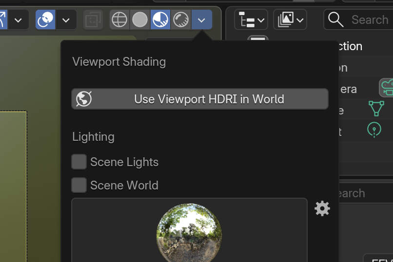

##Preview World to Render

This addon will add a button to the shading panel that allows you to copy the currently active world in the material-preview to your world so that you can use it in rendering. Usefull for quick setups or for the moment we all know, when your material-preview looks better than in your current render. 

